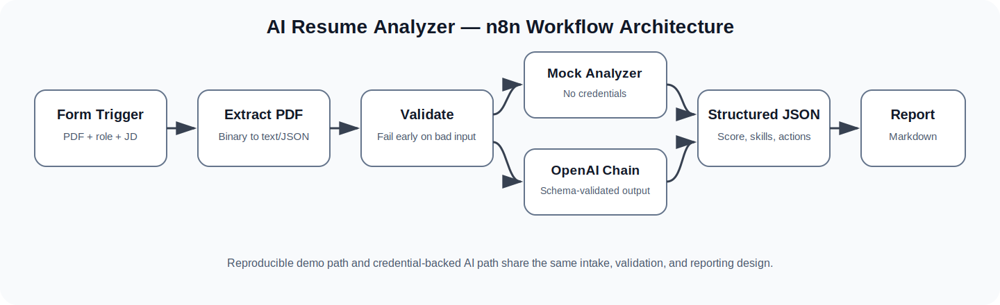
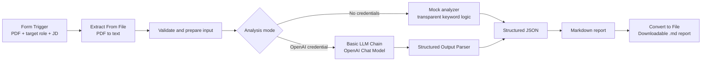
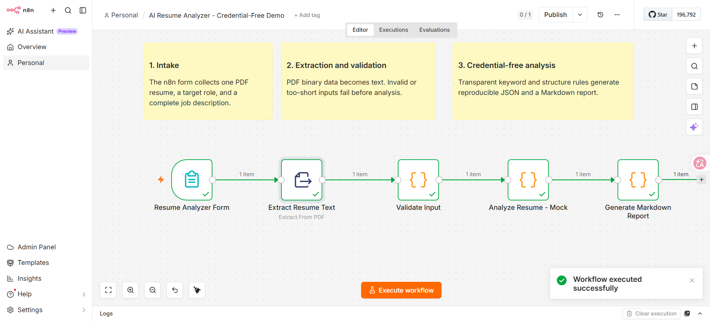
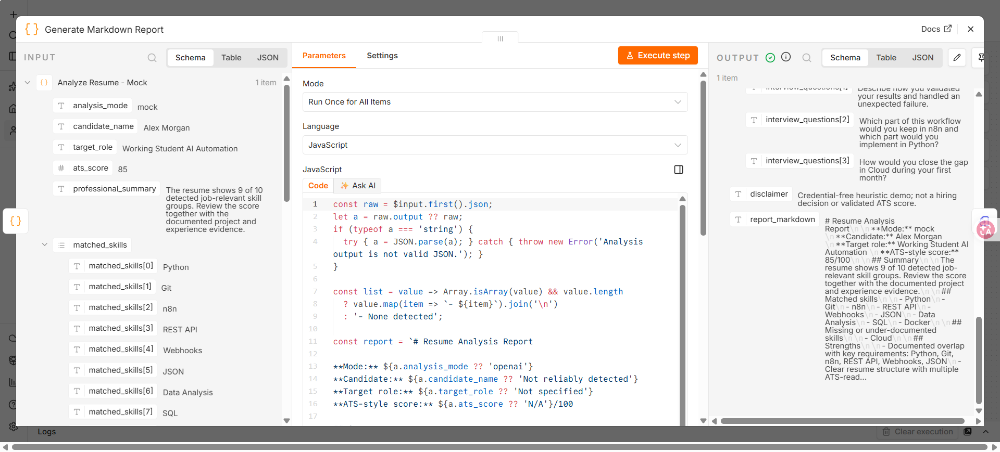
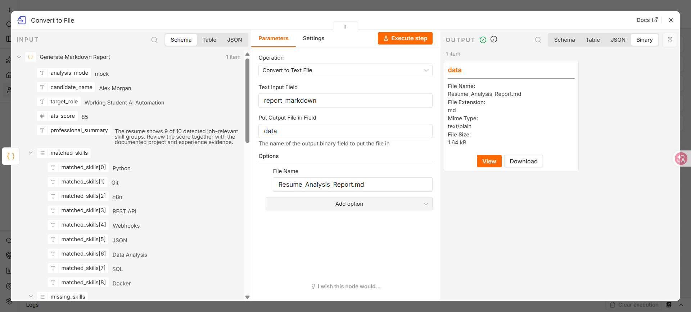

# AI Resume Analyzer with n8n

A portfolio-ready workflow that accepts a PDF resume and a job description, extracts and validates the resume text, evaluates job fit, generates a structured analysis, and produces a downloadable Markdown report.

The repository includes two n8n workflows:

- **Credential-free demo:** deterministic mock analysis for immediate testing.
- **OpenAI workflow:** LLM-based analysis with structured JSON output.

> This project is designed as a transparent workflow-automation portfolio project, not as an automated hiring decision system. Scores are decision-support signals and must not replace human review.

## What the workflow does

1. Collects a PDF resume, target role, and job description through an n8n form.
2. Extracts text from the PDF.
3. Validates that the resume and job description contain usable content.
4. Runs either a credential-free rules-based analyzer or an OpenAI model.
5. Produces a consistent JSON result with an ATS-style score, strengths, gaps, matched skills, missing skills, recommendations, and interview questions.
6. Formats the result as a Markdown report.
7. Converts the Markdown report into a downloadable `.md` file.

## Validation

The workflow was successfully tested on n8n Cloud (July 2026).

Test scenario:

- Upload PDF resume
- Extract resume text
- Validate input
- Analyze resume
- Generate Markdown report
- Convert the report into a downloadable Markdown file

Result:

All nodes executed successfully, including the final Convert to File node.


## Architecture





## Repository structure

```text
n8n-ai-resume-analyzer/
├── workflow/
│   ├── n8n_resume_analyzer_mock.json
│   ├── n8n_resume_analyzer_openai.json
│   └── README.md
├── src/
│   └── resume_analyzer.py
├── tests/
│   └── test_resume_analyzer.py
├── sample_data/
│   ├── sample_resume.pdf
│   └── sample_job_description.txt
├── outputs/
│   ├── example_analysis.json
│   ├── example_report.md
│   └── sample_resume_analysis_report.md
├── prompts/
│   └── resume_analysis_prompt.md
├── docs/
│   ├── ARCHITECTURE.md
│   ├── N8N_VALIDATION.md
│   ├── TESTING.md
│   ├── INTERVIEW_GUIDE.md
│   ├── GITHUB_PUBLISHING.md
│   ├── architecture.svg
│   └── screenshots/
├── run_demo.bat
├── run_demo.sh
├── .env.example
├── .gitignore
├── CHANGELOG.md
├── LICENSE
└── requirements.txt
```

## Quick start: run without accounts

The local Python demo mirrors the transparent mock-analysis logic and does not require n8n or an API key.

### Windows

Double-click:

```text
run_demo.bat
```

Or run:

```powershell
python src/resume_analyzer.py ^
  --resume sample_data/sample_resume.txt ^
  --job sample_data/sample_job_description.txt ^
  --target-role "Working Student AI Automation" ^
  --output-dir outputs
```

### macOS / Linux

```bash
chmod +x run_demo.sh
./run_demo.sh
```

Generated files:

```text
outputs/analysis.json
outputs/report.md
```

## Quick start: verify in n8n without an API key

1. Open n8n and create a new workflow.
2. Import `workflow/n8n_resume_analyzer_mock.json`.
3. Open the **Resume Analyzer Form** node.
4. Select **Test workflow**.
5. Upload a text-based PDF resume, enter a target role, and paste a job description.
6. Submit the form.
7. Open the **Generate Markdown Report** node and inspect `report_markdown`.
8. Open the final **Convert to File** node.
9. In the Binary output, download `Resume_Analysis_Report.md`.

Detailed instructions: [`docs/N8N_VALIDATION.md`](docs/N8N_VALIDATION.md)

### Test with the included sample data

The repository includes fictional test files that can be safely used for public demonstrations:

- `sample_data/sample_resume.pdf`
- `sample_data/job_description.txt`

Upload the sample resume and paste the contents of the job description file into the n8n form.


## Enable real AI analysis

Import `workflow/n8n_resume_analyzer_openai.json`, then:

1. Open **OpenAI Chat Model**.
2. Add an OpenAI API credential through n8n's credential interface.
3. Select an available low-cost model.
4. Run the same form test.
5. Inspect the structured output and Markdown report.

Never hardcode an API key in a workflow JSON, source file, screenshot, or Git commit.

## Example output

```json
{
  "analysis_mode": "mock",
  "target_role": "Working Student AI Automation",
  "ats_score": 86,
  "matched_skills": ["Python", "Git", "REST API", "Data Analysis"],
  "missing_skills": ["n8n", "Docker"],
  "strengths": [
    "Strong overlap with the technical requirements",
    "Resume contains measurable project outcomes"
  ],
  "recommended_actions": [
    "Add one n8n workflow project with screenshots and an architecture diagram",
    "Mention hands-on REST API integration explicitly"
  ]
}
```

## Testing and error handling

The workflow checks for:

- Missing or unreadable PDF text.
- Resume text that is suspiciously short.
- Missing or incomplete job descriptions.
- Invalid LLM output through a JSON schema.
- Missing OpenAI credentials in the AI version.

Run the local tests:

```bash
python -m unittest discover -s tests -v
```

## Design decisions

- **Form Trigger:** creates a small upload interface without a separate frontend.
- **Extract From File:** converts the uploaded PDF from binary data to text/JSON.
- **Code node:** validates input and implements transparent demo logic.
- **Convert to File:** converts the generated Markdown string into a downloadable report file.
- **Basic LLM Chain:** sends a controlled prompt to the model; an agent is unnecessary because no autonomous tool selection is required.
- **Structured Output Parser:** enforces a predictable JSON structure.
- **Separate mock and AI workflows:** allows recruiters to reproduce the project without credentials while preserving a realistic production upgrade path.

## Privacy and responsible use

Resumes contain personal data. Do not commit real resumes, private job applications, API keys, or unredacted analysis reports. The `.gitignore` excludes the intended private-data folders.

AI-generated evaluations can contain errors or bias. Use the output for resume improvement and workflow demonstration only. Do not use it as the sole basis for employment decisions.

## Portfolio description

> Built an n8n-based resume analysis workflow that accepts PDF uploads, extracts and validates resume text, compares candidate skills against a job description, and generates structured JSON and Markdown reports. Implemented a credential-free reproducible demo, an OpenAI upgrade path, schema-validated output, tests, documentation, privacy safeguards, and error handling.

## Screenshots

### Successful workflow execution

The complete n8n workflow executes successfully from PDF upload to downloadable report generation.



### Resume analysis output

The workflow generates a structured ATS-style analysis with matched skills, missing skills, recommendations, and interview questions.



### Downloadable Markdown report

The final Convert to File node creates a downloadable Markdown report.




## License

MIT License. See [`LICENSE`](LICENSE).


